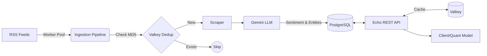
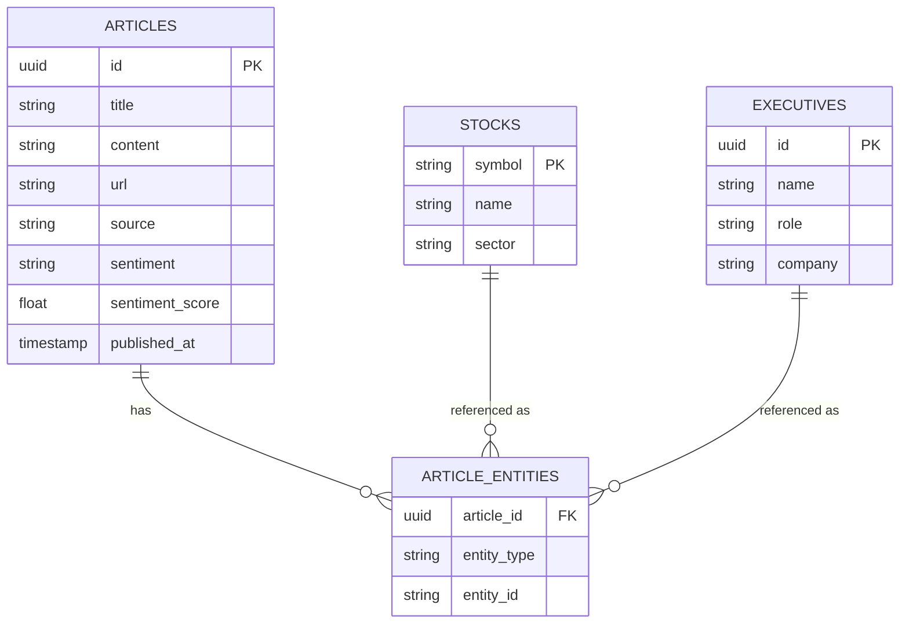

# Quant Market Intelligence Pipeline 🇮🇩 📈


## 📌 Overview

A high-throughput automated **Market Intelligence & Quant News Pipeline** focused on the Indonesian stock market (IDX/BEI). This system ingests RSS feeds, deduplicates them, scrapes full article content, and analyzes it using AI (Gemini) for sentiment analysis and entity extraction. The processed data is persisted in PostgreSQL and served via a REST API with Valkey caching, designed for quantitative analysis and algorithmic trading signals.

## ✨ Features

- **Concurrent RSS Feed Ingestion**: High-performance worker pools for fetching and parsing RSS feeds.
- **URL Deduplication**: Efficient deduplication using MD5 hashing stored in Valkey.
- **AI-Powered Sentiment Analysis**: Leverages Google Gemini API to analyze market sentiment (Bullish/Bearish/Neutral) with confidence scores (-1.0 to +1.0).
- **Entity Extraction**: Automatically identifies and extracts companies, executives, sectors, and IDX tickers mentioned in articles.
- **RESTful API**: Fast and scalable API with pagination, filtering, and caching built on Echo v4.
- **Resilience**: Implements exponential backoff retry and rate limiting for external API calls.
- **Graceful Shutdown**: Ensures all in-flight processes and database connections are closed safely.
- **Cloud-Native**: Stateless design, distroless Docker container, ready for deployment on GCP Cloud Run.

## 🏗 Architecture



## 🛠 Tech Stack

| Component | Technology |
|---|---|
| **Language** | Go 1.25 |
| **API Framework** | Echo v4 |
| **Database** | PostgreSQL 16 (pgx v5) |
| **Cache/Broker** | Valkey 8 |
| **AI/LLM** | Google Gemini API |
| **Container** | Docker (distroless) |
| **Deployment** | GCP Cloud Run |
| **Architecture** | Clean Architecture |

## 📋 Prerequisites

- Go 1.23+
- Docker & Docker Compose
- Gemini API Key (from [Google AI Studio](https://aistudio.google.com/))
- PostgreSQL 16 (via Docker or managed service)
- Valkey 8 (via Docker or managed service)

## 🚀 Quick Start

1. **Clone the repository:**
   ```bash
   git clone https://github.com/javier-garcia/quant-indonesia-scraping.git
   cd quant-indonesia-scraping
   ```

2. **Copy the example environment file:**
   ```bash
   cp .env.example .env
   ```

3. **Set your Gemini API key in `.env`:**
   ```env
   GEMINI_API_KEY=your_gemini_api_key_here
   ```

4. **Start the database and cache using Docker Compose:**
   ```bash
   docker compose up -d
   ```

5. **Run Database Migrations:**
   ```bash
   # Make sure PostgreSQL is ready
   PGPASSWORD=postgres psql -h localhost -U postgres -d quant_intel -f migrations/001_initial_schema.sql
   # Run remaining migrations if any...
   ```

6. **Run the server:**
   ```bash
   go run ./cmd/server
   ```

7. **Test the API:**
   ```bash
   curl -X GET http://localhost:8080/health
   ```

## ⚙️ Configuration

Environment variables used to configure the application:

| Variable | Description | Default |
|---|---|---|
| `PORT` | API Server port | `8080` |
| `ENV` | Environment (`development`, `production`) | `development` |
| `DB_HOST` | PostgreSQL Host | `localhost` |
| `DB_PORT` | PostgreSQL Port | `5432` |
| `DB_USER` | PostgreSQL User | `postgres` |
| `DB_PASSWORD` | PostgreSQL Password | `postgres` |
| `DB_NAME` | PostgreSQL Database Name | `quant_intel` |
| `VALKEY_ADDR` | Valkey Address | `localhost:6379` |
| `GEMINI_API_KEY`| Google Gemini API Key | *(Required)* |
| `WORKER_COUNT` | Number of concurrent ingestion workers | `5` |

## 📚 API Documentation

### 1. Health Check
`GET /health`
```json
{
  "status": "ok",
  "time": "2026-08-11T05:30:00Z"
}
```

### 2. Trigger Ingestion Pipeline
`POST /api/v1/ingestion/trigger`
**Request Body:**
```json
{
  "sources": [
    "https://example.com/rss/market-news"
  ]
}
```
**Response:**
```json
{
  "status": "success",
  "message": "Ingestion pipeline triggered successfully",
  "job_id": "job-12345"
}
```

### 3. List Articles
`GET /api/v1/articles`
**Query Parameters:**
- `symbol` (string): Filter by IDX ticker (e.g., BBCA)
- `sentiment` (string): Filter by sentiment (Bullish, Bearish, Neutral)
- `source` (string): Filter by news source
- `from` (string): Start date (YYYY-MM-DD)
- `to` (string): End date (YYYY-MM-DD)
- `limit` (int): Items per page (default: 20)
- `offset` (int): Pagination offset (default: 0)

**Response:**
```json
{
  "data": [
    {
      "id": "123e4567-e89b-12d3-a456-426614174000",
      "title": "BBCA Reports Record Profits",
      "url": "https://news.example.com/bbca",
      "sentiment": "Bullish",
      "sentiment_score": 0.85,
      "published_at": "2026-08-11T00:00:00Z"
    }
  ],
  "meta": {
    "total": 150,
    "limit": 20,
    "offset": 0
  }
}
```

### 4. Get Article by ID
`GET /api/v1/articles/:id`

### 5. List Stocks
`GET /api/v1/stocks`
**Query Parameters:** `sector`, `limit`, `offset`

### 6. Get Stock by Symbol
`GET /api/v1/stocks/:symbol`

## 🗄 Database Schema



## 📁 Project Structure

```text
quant-indonesia-scraping/
├── cmd/server/          # Application entrypoint (main.go)
├── config/              # Configuration loading and env parsing
├── domain/              # Core business logic, interfaces, and entities
├── delivery/http/       # HTTP transport layer (Echo handlers, router, middleware)
├── ingestion/           # Pipeline logic: Feed fetching, workers, scrapers
├── llm/                 # AI Integration: Gemini API client and prompts
├── pkg/                 # Shared utilities (hasher, httpclient, logger)
├── repository/          # Data persistence layer
│   ├── postgres/        # PostgreSQL implementations
│   └── valkey/          # Valkey (Redis-compatible) cache/dedup implementations
├── usecase/             # Application specific business rules
├── migrations/          # SQL database migrations
├── docker-compose.yml   # Local infrastructure
├── Dockerfile           # Multi-stage Distroless Dockerfile
└── ...
```

## 💻 Development

- **Run Tests:**
  ```bash
  go test ./... -v
  ```
- **Build Binary:**
  ```bash
  go build -o server ./cmd/server
  ```
- **Linting:**
  It is recommended to use `golangci-lint`:
  ```bash
  golangci-lint run
  ```

## 🐳 Docker

- **Build Image:**
  ```bash
  docker build -t quant-intel .
  ```
- **Run Container:**
  ```bash
  docker run -p 8080:8080 --env-file .env quant-intel
  ```

## ☁️ Deployment to Cloud Run

The application is designed to be stateless and is optimized for GCP Cloud Run.

1. **Build & Push to Artifact Registry:**
   ```bash
   gcloud builds submit --tag gcr.io/YOUR_PROJECT_ID/quant-intel
   ```
2. **Deploy to Cloud Run:**
   Deploy the image, mapping environment variables securely using Secret Manager.
3. **Database & Cache:**
   - Provision a Cloud SQL instance for PostgreSQL 16.
   - Provision a Memorystore instance for Redis/Valkey.
   - Ensure Cloud Run has the appropriate VPC connectors to access these resources.

## 📄 License

This project is licensed under the MIT License - see the LICENSE file for details.
